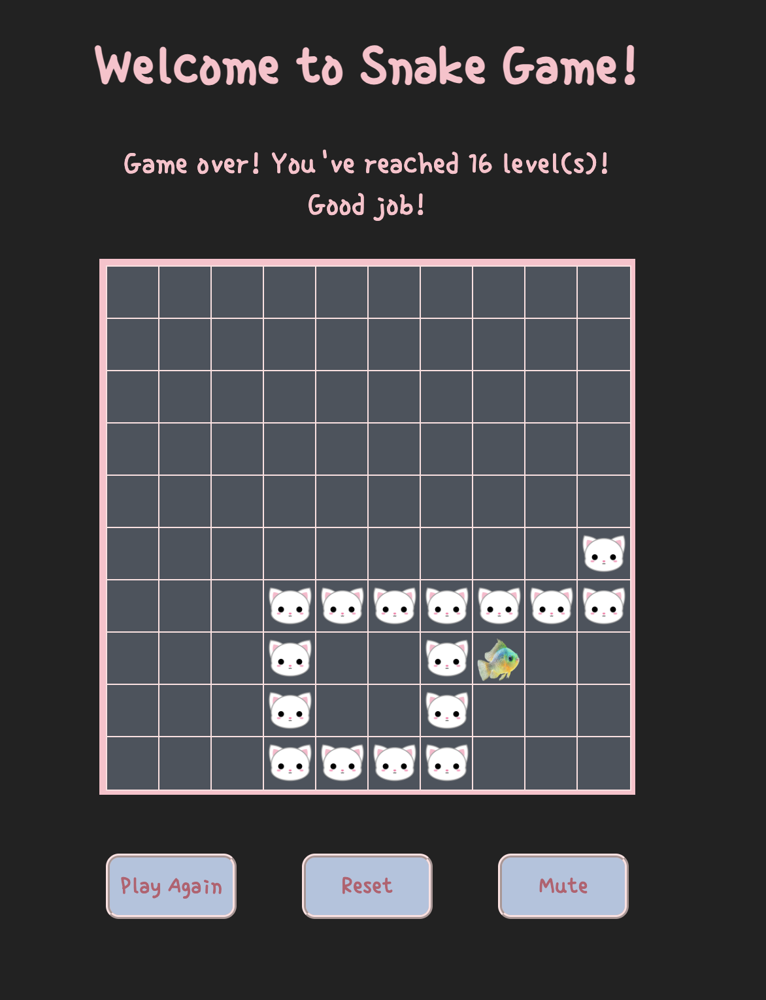

# Welcome to My Snake (Cat) game!
I chose to recreate the classic snake game for my browser game project because it was one of the very first games I played as a kid. My dad owned a Nokia 8850, and I remembered spending hours having fun with the simple yet addicting game on that tiny pixelated black and white screen! 

For this version, I wanted to add a little twist — instead of the traditional snake, you play as a cat chasing fish!

 
Link to game: https://tsztin0217.github.io/snake-game/

### How to play:
1. press *Start* button to start the game. 
2. Use arrow keys *← ↑ → ↓* to move your cat within the 10 x 10 grid. 
3. Eat the fish to grow longer and move faster!
4. Game over when:
    - Hit the edge of the grid
    - Turn into your own body in the opposite direction

After the game ends, you can either press *Reset* to read the instructions again or press *Play Again* to restart immediately!

While the game is still far from perfect and has limited features, I hope you enjoy playing it as much as I enjoyed building it! 

## Current Bugs
- Food occasionally spawns on the cat's body which momentarily distorts the grid

## Future Improvements
- Make food respawn at a location different than the one that a cat segment is currently occupying 
- Light/dark mode
- Allow for mobile touch controls

## Technologies Used:
- JavaScript
- HTML
- CSS

## Sources
### Assets
- Cat icon png image from [pngtree.com](https://pngtree.com/freepng/cute-white-cat-head_4242401.html)
- Game over meowing sound effect by <a href="https://pixabay.com/users/yoursperfectguy-46268990/?utm_source=link-attribution&utm_medium=referral&utm_campaign=music&utm_content=246012">Abby</a> from <a href="https://pixabay.com//?utm_source=link-attribution&utm_medium=referral&utm_campaign=music&utm_content=246012">Pixabay</a>

- Eat food meowing sound effect by <a href="https://pixabay.com/users/freesound_community-46691455/?utm_source=link-attribution&utm_medium=referral&utm_campaign=music&utm_content=38576">freesound_community</a> from <a href="https://pixabay.com//?utm_source=link-attribution&utm_medium=referral&utm_campaign=music&utm_content=38576">Pixabay</a>

### References
- [Window: setInterval() method](https://developer.mozilla.org/en-US/docs/Web/API/Window/setInterval)
- [Transform Origin | MDN](https://developer.mozilla.org/en-US/docs/Web/CSS/transform-origin)
- [Disable arrow key scrolling in users browser | stackoverflow](https://stackoverflow.com/questions/8916620/disable-arrow-key-scrolling-in-users-browser)
- [CSS grid layout | MDN](https://developer.mozilla.org/en-US/docs/Web/CSS/CSS_grid_layout/Basic_concepts_of_grid_layout)
- [Key values for keyboard events](https://developer.mozilla.org/en-US/docs/Web/API/UI_Events/Keyboard_event_key_values)
- [Math.floor | MDN](https://developer.mozilla.org/en-US/docs/Web/JavaScript/Reference/Global_Objects/Math/floor)
