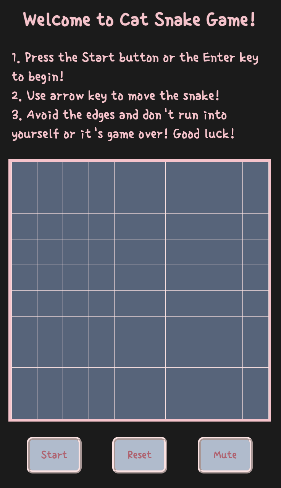
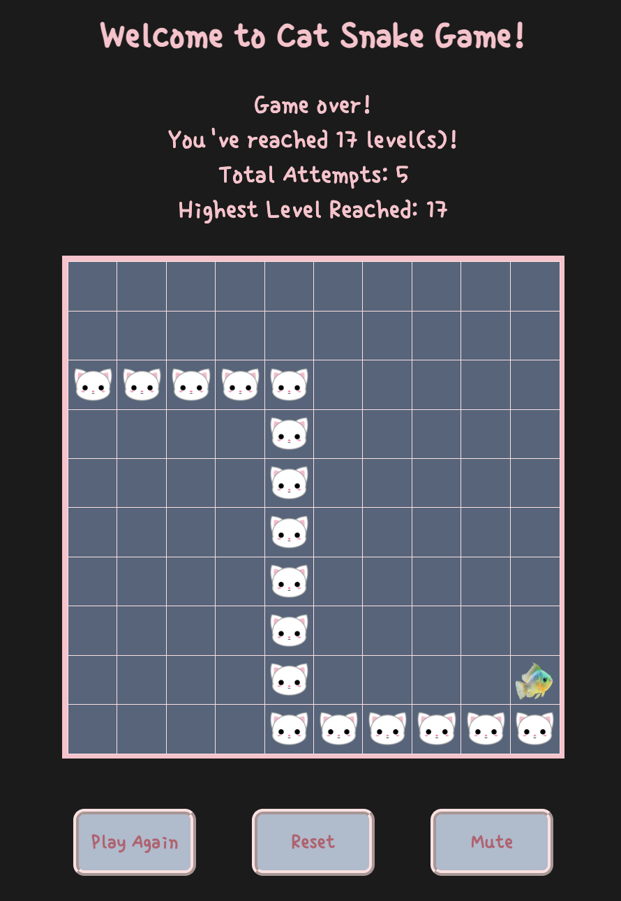

# Welcome to My Cat Snake game!
I chose to recreate the classic snake game for my browser game project because it was one of the very first games I played as a kid. My dad owned a Nokia 8850, and I remembered spending hours having fun with the simple yet addicting game on that tiny pixelated black and white screen! 

For this version, I wanted to add a little twist — instead of the traditional snake, you play as a cat chasing fish!
 
 
Link to game: https://tsztin0217.github.io/snake-game/

### How to Play:
1. Press *Start* button or *Enter* key to start the game. 
2. Use arrow keys *← ↑ → ↓* to move your cat within the 10 x 10 grid. 
3. Eat the fish to grow longer and move faster!
4. Game over when:
    - Hit the edge of the grid
    - Turn into your own body in the opposite direction
5. To win:
    - Reach level 20!

After the game ends, you can either press *Reset* to read the instructions again or press *Play Again* to restart immediately!

While the game is still far from perfect and has limited features, I hope you enjoy playing it as much as I enjoyed building it! 

## Features
- Display
    -  Current level
    -  Highest level reached
    -  Attempt count
- Sound effects
    -  Cat meows after eatng food
    -  Sad meows when game is over
- Buttons
    -  Start/Play Again
    -  Reset (resets all displays and records)
    -  Mute sound effects

## Updates
- No more grid cell distortion — fixed food respawn issue!

## Future Improvements
- ~~Make the food respawn at a location different from the one occupied by a cat segment~~
- Generate randomized encouraging messages for each level to add variety and enhance gameplay
- Implement light/dark mode
- Add mobile touch controls
- Allow the "M" key to mute

## Technologies Used:
- JavaScript
- HTML
- CSS

## Sources
### Assets
- Cat icon png image from [pngtree.com](https://pngtree.com/freepng/cute-white-cat-head_4242401.html)
- Game over meowing sound effect by <a href="https://pixabay.com/users/yoursperfectguy-46268990/?utm_source=link-attribution&utm_medium=referral&utm_campaign=music&utm_content=246012">Abby</a> from <a href="https://pixabay.com//?utm_source=link-attribution&utm_medium=referral&utm_campaign=music&utm_content=246012">Pixabay</a>

- Eat food meowing sound effect by <a href="https://pixabay.com/users/freesound_community-46691455/?utm_source=link-attribution&utm_medium=referral&utm_campaign=music&utm_content=38576">freesound_community</a> from <a href="https://pixabay.com//?utm_source=link-attribution&utm_medium=referral&utm_campaign=music&utm_content=38576">Pixabay</a>

- Cat Snake Game logo created on [vistaprint.com](https://www.vistaprint.com/logomaker/download/share/67c104cad823577c979794fe)

### References
- [Window: setInterval() method](https://developer.mozilla.org/en-US/docs/Web/API/Window/setInterval)
- [Transform Origin | MDN](https://developer.mozilla.org/en-US/docs/Web/CSS/transform-origin)
- [Disable arrow key scrolling in users browser | stackoverflow](https://stackoverflow.com/questions/8916620/disable-arrow-key-scrolling-in-users-browser)
- [CSS grid layout | MDN](https://developer.mozilla.org/en-US/docs/Web/CSS/CSS_grid_layout/Basic_concepts_of_grid_layout)
- [Key values for keyboard events | MDN](https://developer.mozilla.org/en-US/docs/Web/API/UI_Events/Keyboard_event_key_values)
- [Math.floor | MDN](https://developer.mozilla.org/en-US/docs/Web/JavaScript/Reference/Global_Objects/Math/floor)
- [How do I put my website's logo to be the icon image in browser tabs | stackoverflow](https://stackoverflow.com/questions/11488960/how-do-i-put-my-websites-logo-to-be-the-icon-image-in-browser-tabs)
- [cloneNode() method | MDN](https://developer.mozilla.org/en-US/docs/Web/API/Node/cloneNode)
- [Translate a 2D coordinate into a 1D array](https://stackoverflow.com/questions/51009297/translate-a-2d-coordinate-into-a-1d-array)